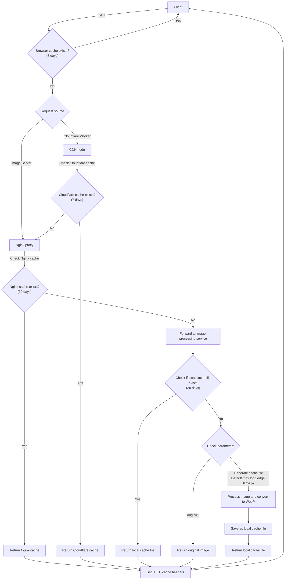
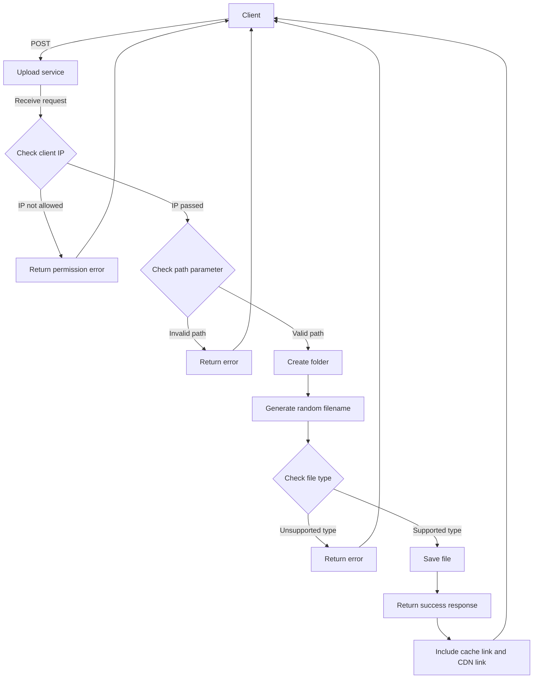

# Image Caching Server

> Upload and delete functions are designed for internal network use, so they will have minimal restrictions.

## Features

> This system provides storage and caching for uploaded images to improve web resource response speed.

- **Browser Caching**
    Stores previously requested resources to reduce repeated backend requests, serving directly from browser <br>
    Expected expiration time (1 week)
- **Cloudflare CDN**
    Enables users from different countries to access content from the nearest node, reducing cross-regional transmission delays (high latency in transoceanic transmission) <br>
    Expected expiration time (1 week)
- **Backend Caching**
    Avoids regenerating identical resources, saving server computation, expected expiration time (1 month) <br>
    Nginx caching, reduces Nodejs backend processing, expected expiration time (1 month)

### Default Webp

Default output format is Webp, maintaining good image quality while significantly reducing output traffic. Using the `t / type` parameter can specify output format (avif/webp/jpg/png), or the `o / origin` parameter controls whether to output the original file.

### Caching Design

Multi-level cache structure: Provides four layers of caching - browser, CDN, Nginx, and cached images
- Parameterized caching: Different versions of the same image are generated and cached based on various size and quality parameters
- Cache directory structure: Based on the original file path, corresponding directory structures are created under `/storage/image/cache/`

### Error Handling

- For non-existent images: Returns a custom 404 image (controlled by the `d / dark` parameter for dark/light mode)
- For image processing failures: Returns an explanatory message

### Trash

Date-organized trash bin mechanism

- Deleted files are moved to the `/storage/image/upload/.trash/YYYY-MM-DD/`# Uploads image to the `/storage/image/upload/[PATH]` folder
- Trash organized by date for easier recovery of files deleted on a specific date
- System returns the file's location in the trash bin for easy restoration if needed

***

### POST：`/upload/{:path}` 

> The `:path` part can include `/` and will upload directly to the specified location.

```Shell
# Uploads image to the `/storage/image/upload/[PATH]` folder
curl -X POST \
-H "Content-Type: multipart/form-data" \
-F "filepath=@/Users/pardn/Desktop/Wallpaper-Desktop/rain_clouds_sky-wallpaper-5120x3200.jpg" \
[URL]/upload/[PATH]
```
- Successful upload: 201 -> `JSON`
    ```Json
    {
        "success": 1,
        "filename": "ERftP1gTS7WCTeJ8_1744080848530.jpg",
        "type": "image/jpeg",
        "size": 2501808,
        "src": "[URL]/upload/[PATH]/c/img/test2/test1/ERftP1gTS7WCTeJ8_1744080848530.jpg"
    }
    ```
- Path Null: 400 -> `String`
    ```
    請至少規劃一個資料夾位置
    ```
- Type Error: 400 -> `String`
    ```
    僅支持 jpg / png / webp / svg / pdf
    ```
- Upload Error: 500 -> `String`
    ```
    檔案不存在或上傳失敗
    ```

### DELETE：`/del/{:path}` 

> The `:path` part can include `/` and will delete the image at the specified location.

```Shell
# Delete `AQepGMnNiOxrnsKu_1744035656038.jpg` in the `/storage/image/upload/[PATH]` folder
curl -X DELETE \
-H "Content-Type: application/json" \
[URL]/del/[PATH]/AQepGMnNiOxrnsKu_1744035656038.jpg

# Delete folder /storage/image/upload/[PATH]
curl -X DELETE \
-H "Content-Type: application/json" \
[URL]/del/[PATH]
```
- Successful deletion: 200 -> `JSON`
    ```Json
    // 檔案
    {
        "success": 1,
        "message": "檔案已移動至垃圾桶: /storage/image/upload/.trash/2025-04-08/[PATH]/AQepGMnNiOxrnsKu_1744035656038.jpg"
    }

    // 檔案夾
    {
        "success": 1,
        "message": "檔案夾已移動至垃圾桶: /storage/image/upload/.trash/2025-04-08/[PATH]"
    }
    ```
- 400 -> `String`
    ```
    未指定檔案/檔案夾
    ```
- 404 -> `String`
    ```
    檔案/檔案夾不存在
    ```
- 500 -> `String`
    ```
    [Error Message]
    ```

### GET：`/c/img/{:filepath}`

#### Available Parameters
- `o / origin`: Return original file (highest priority)
- `s / size`: Specify image short edge length (higher priority than width/height)
- `w / width`: Specify image width
- `h / height`: Specify image height
- `q / quality`: Specify image quality (1-100), default 75
- `t / type`: Specify type (avif|webp|jpg|png), default webp
- `d / dark`: Specify 404 image color scheme (1|0), default 0

### CDN

> Change URL to point to Cloudflare worker to achieve global caching.

### Flow

<details>
<summary>Load</summary>



</details>

<details>
<summary>Upload</summary>



</details>
