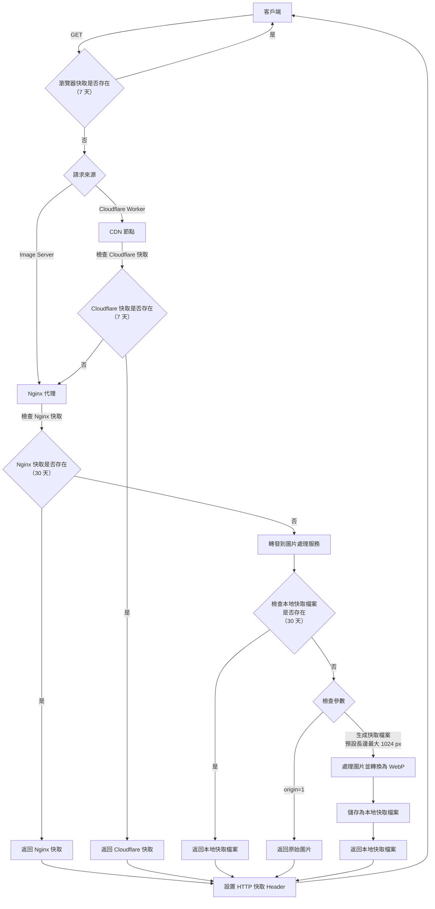
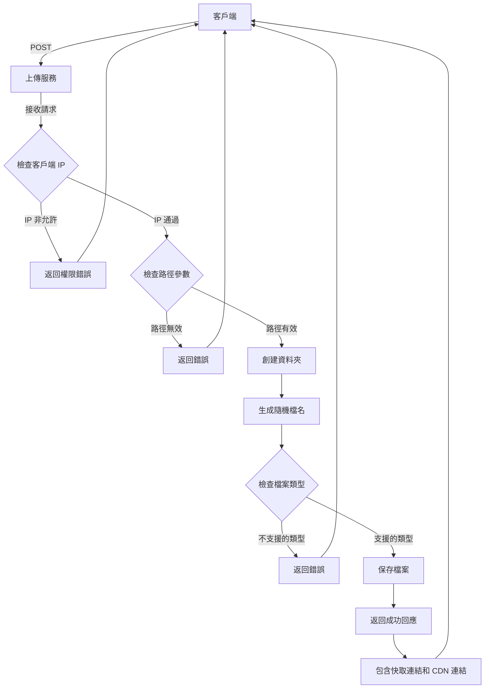

# 圖片快取伺服器

> 上傳與刪除功能因為後續是要規劃只給區網用的，所以不會做太多限制。

## 專案需求

> 針對 LLM 生成的圖片做儲存與快取，加快網頁的資源響應速度。

- **前端快取**
    儲存已請求過的資源，減少對後端的重複請求，而是瀏覽器中直接回應
    預計過期時間（1 週）
- **Cloudflare CDN**
    使各國家用戶能從最近的節點獲取內容，減少跨地區傳輸延遲（跨海傳輸延遲高）
    預計過期時間（1 週）
- **後端快取**
    避免重複生成相同資源，節省伺服器運算，預計過期時間（1 個月）
    Nginx 快取，減少 Nodejs 後端運算，預計過期時間（1 個月）

## 專案特點

### 預設 Webp

預設輸出格式為 Webp，保持良好的圖片品質同時大幅減少輸出流量。透過 `t / type` 參數可以指定輸出格式（avif/webp/jpg/png），或 `o / origin` 參數控制是否輸出原檔。

### 快取機制

多層級快取結構：提供瀏覽器、CDN、Nginx 和快取圖四層快取
- 參數化快取：根據不同的尺寸和品質參數，系統會生成並快取不同版本的同一圖片
- 快取目錄結構：以原始檔案路徑為基礎，在 /storage/image/cache/ 下建立對應的目錄結構

### 錯誤處理

- 圖片不存在的：返回自訂的 404 圖片（透過 `d / dark` 參數控制深色/淺色）
- 圖片處理失敗：返回說明訊息

### 垃圾桶機制

按日期整理的垃圾桶機制

- 刪除的檔案會移動到 `/storage/image/upload/.trash/YYYY-MM-DD/` 檔案夾
- 按日期組織垃圾桶，便於找回特定日期刪除的檔案
- 系統會返回檔案在垃圾桶中的位置，方便需要時恢復

***

### POST：`/upload/{:path}` 

> `:path` 部分可以包含 `/` 會直接依據指定位置上傳。

```Shell
# 將圖片上傳至 `/storage/image/upload/[PATH]` 的檔案夾中
curl -X POST \
-H "Content-Type: multipart/form-data" \
-F "filename=@/Users/pardn/Desktop/Wallpaper-Desktop/rain_clouds_sky-wallpaper-5120x3200.jpg" \
[URL]/upload/[PATH]
```
- 成功上傳：201 -> `JSON`
    ```Json
    {
        "success": 1,
        "filename": "ERftP1gTS7WCTeJ8_1744080848530.jpg",
        "type": "image/jpeg",
        "size": 2501808,
        "src": "[URL]/upload/[PATH]/c/img/test2/test1/ERftP1gTS7WCTeJ8_1744080848530.jpg"
    }
    ```
- Path Null：400 -> `String`
    ```
    請至少規劃一個資料夾位置
    ```
- Type Error：400 -> `String`
    ```
    僅支持 jpg / png / webp / svg / pdf
    ```
- Upload Error：500 -> `String`
    ```
    檔案不存在或上傳失敗
    ```

### DELETE：`/del/{:path}` 

> `:path` 部分可以包含 `/` 會直接依據指定位置圖片做刪除。

```Shell
# 刪除 `/storage/image/upload/[PATH]` 檔案夾中的 `AQepGMnNiOxrnsKu_1744035656038.jpg`
curl -X DELETE \
-H "Content-Type: application/json" \
[URL]/del/[PATH]/AQepGMnNiOxrnsKu_1744035656038.jpg

# 刪除檔案夾 /storage/image/upload/[PATH]
curl -X DELETE \
-H "Content-Type: application/json" \
[URL]/del/[PATH]
```
- 成功刪除：200 -> `JSON`
    ```Json
    // 檔案
    {
        "success": 1,
        "message": "檔案已移動至垃圾桶: /storage/image/upload/.trash/2025-04-08/[PATH]/AQepGMnNiOxrnsKu_1744035656038.jpg"
    }

    // 檔案夾
    {
        "success": 1,
        "message": "檔案夾已移動至垃圾桶: /storage/image/upload/.trash/2025-04-08/[PATH]"
    }
    ```
- 400 -> `String`
    ```
    未指定檔案/檔案夾
    ```
- 404 -> `String`
    ```
    檔案/檔案夾不存在
    ```
- 500 -> `String`
    ```
    [Error Message]
    ```

### GET：`/c/img/{:filepath}`

#### 可用參數
- `o / origin`：回傳原始檔（優先級最高）
- `s / size`：指定圖片短邊長度（優先級高於 width / height）
- `w / width`：指定圖片寬度
- `h / height`：指定圖片高度
- `q / quality`：指定圖片質量 (1-100)，預設 75
- `t / type`：指定類型（avif|webp|jpg|png），預設 webp
- `d / dark`：指定 404 圖片色系（1|0），預設 0

### CDN 快取

> 把網址改為 cloudflare worker 指向，達成全球快取。

### 流程圖

<details>
<summary>Upload</summary>



</details>

<details>
<summary>Load</summary>



</details>